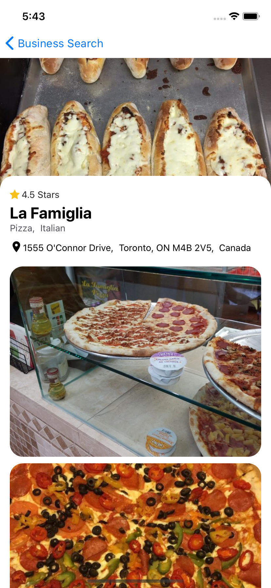

# Food

Simple application for food search and view.

## Motivation

This project was created as an example of how to create a simple React Native application using TypeScript, Redux and React Navigation for Screen routing with API interaction. Food seraching implemented via [yelp](https://www.yelp.com/)

## Code style

Project uses react native community code style from ESLint.

## Tech stack and etc

<b>Built with</b>

- [React Native](https://facebook.github.io/react-native/)
- [Redux](https://redux.js.org/), [redux-thunk](https://github.com/reduxjs/redux-thunk)
- [TypeScript](https://www.typescriptlang.org/)
- [React Navigation](https://reactnavigation.org/)
- [react-content-loader (for skeleton loader technology)](https://github.com/danilowoz/react-content-loader)
- [Icons pack](https://github.com/oblador/react-native-vector-icons)

## iOS Demo

|     Loading process      |  App with data  |
| :----------------------: | :-------------: |
|    |    |
|  |  |

## Android Demo

|         Loading process          |      App with data      |
| :------------------------------: | :---------------------: |
|    |    |
|  |  |

## Installation

`Make sure you have node > 9`

1. `git clone https://github.com/ruslanzharkov/food.git`
2. `cd food`
3. `npx pod-install ios` if you want to run ios from MacOS
4. `npm i`
5. `npx react-native run-ios` or `npx react-native run-android`
6. `let's see running app!`

## Troubleshooting

Android issues and their resolving:

1. Remove debug/prod apk file from `android/app/build/outputs/apk/*`
2. Clean project from terminal gradle or android IDE

iOS issues:

1. Remove `Pods` folder from `ios/Pods` and install from scratch

Make sure u are cleaning watchman, metro bundler
